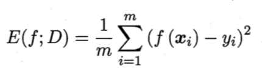
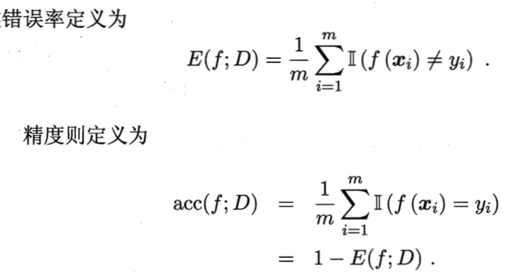
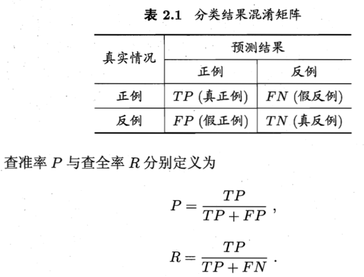
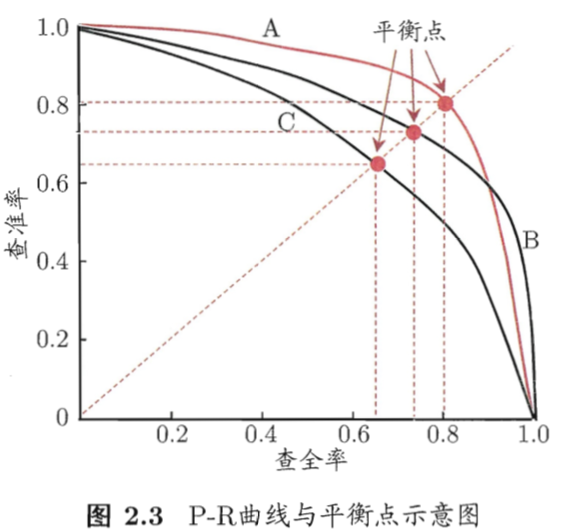
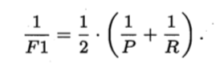
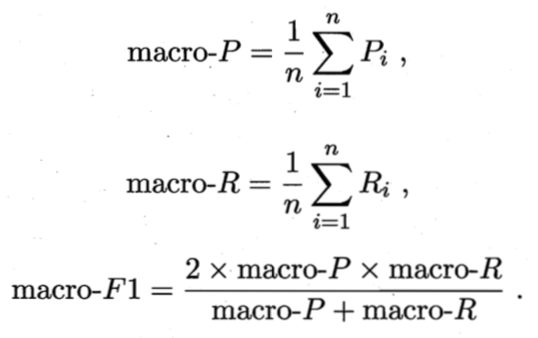
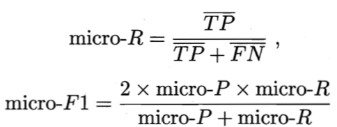
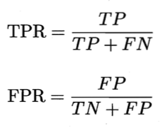
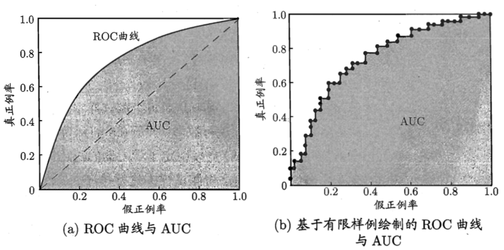

# 02 模型评估与选择

## 基本概念

- 精度(accuracy) = 1 - 错误率 = 1 - a/m
- 训练误差(training error) = 经验误差(empirical error): 在训练集上的误差
- 泛化误差(generalizaiton error): 新样本上的误差
    - 希望得到的是泛化误差小的学习器，但实际能做的是经验误差最小化
- 过拟合(overfitting)
    - 学习能力过高，泛化能力低
    - 例子："无锯齿"树叶 -> 不是树叶
    - 只要承认 P != NP 就无法避免，只能"缓解"
- 欠拟合(underfitting)
    - 学习能力低下，比较容易克服
    - 例子："绿色"树 -> 是树叶
- 模型选择问题(model selection): 选择何种学习算法，何种参数配置的问题
- 测试集(testing set): 研究不同学习算法的泛化性能(对新样本的判别能力)，以测试误差作为泛化误差的近似，测试集应尽量与训练集互斥
- 验证集(validation set): 基于验证集上的性能进行模型选择和调参

## 评估方法

### 留出法(hold-out)

- 直接将数据集 D 划分为训练集 S 和测试集 T，S 和 T 互斥
    - 分层采样(stratified sampling): 保留类别比例的采样
    - |S|/|D| 大小选择：通常为 2/3 - 4/5

### k折交叉验证法(k-fold cross validation)

- 将 D 划分为 k 个大小相似的互斥子集，每个子集 Di 通过分层采样得到
    - 每次用 k-1 个子集的并作为训练集，剩余的作为测试集，一共可进行 k 次训练和测试
    - 通常取 k = 10
    - 通常使用不同的划分重复 p(=10) 次，即 p 次 k 折交叉验证

### 自助法(bootstrapping)

- 数据集 D 的大小为 m，有放回取样 m 个样本作为训练集 D',剩余的 D\D' 作为测试集
    - 样本在 m 次采样中始终不被采样的概率为：
      

    - 即训练集 D' 大小约为 2/3
    - 在数据集较小、难以有效划分训练集/测试集时很有用，但会改变初始数据集分布，引入估计偏差

### 调参(parameter tuning)

- 设定算法参数，常用做法是对每个参数选定一个范围和变化步长

## 性能度量

- 性能度量(performance measure): 衡量模型泛化能力的评价标准
- 均方误差(mean squared error) 回归任务常用
  

### 错误率与精度

### 准确率 召回率 F1

- 准确率："挑出的🍉中有多少是好瓜"
- 召回率："所有的好🍉中有多少比例被挑出来了"
  

- 准确率和召回率是一对矛盾的度量，通过 P-R 图衡量学习器的性能
  

    - A 性能优于 C：因为A 完全包住 C
    - A 与 B 的比较
        - P-R 曲线下的面积大小
        - 平衡点(BEP, Break-Even Point) A 性能优于 B
    - F1：比 BEP 更常用的指标
      

- 多组混淆矩阵时计算 P 和 R
    - 宏准确率, 宏召回率, 宏 F1：
      

    - 微准确率, 微召回率, 微 F1：
      

### ROC AUC

- ROC = Receiver Operating Characteristic 受试者工作特征
    - 纵坐标为真正例率(TP Rate)，横坐标为假正例率(FP Rate)
    - 预测概率从大到小排列后，将 cut point 依次设置为每个概率值计算其 TPR 和 FPR
    - 对角线对应于"随机乱猜"模型
      

      

- 衡量不同 ROC 曲线的性能
    - A 完全包住 B：A 优于 B
    - AUC = Area Under ROC Curve

### 代价敏感错误率

- 思想：不同类型的错误(FP/FN)代价不同，计算损失的时候要考虑非均等代价(unequal cost)