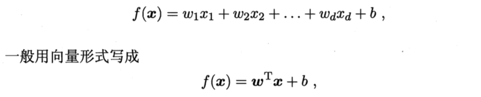
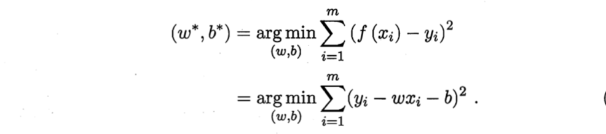
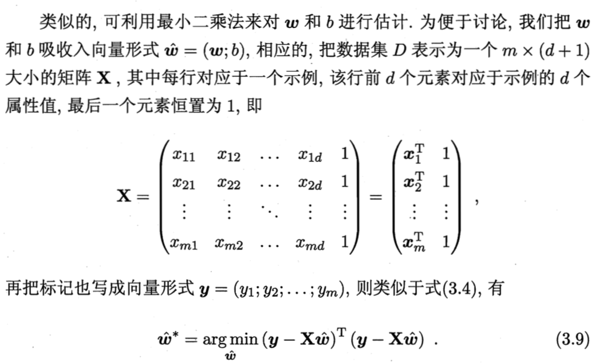
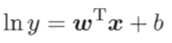
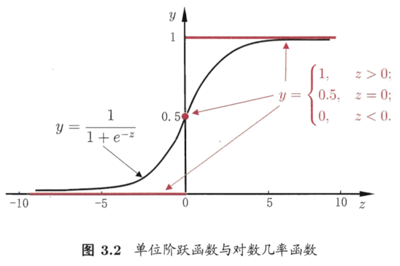
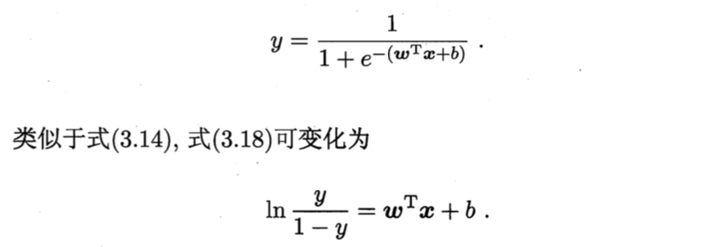
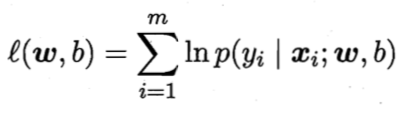

# 03 线性模型

## 3.1 基本形式

- 线性模型(linear model)试图学得一个通过属性的线性组合进行预测的函数 f(x)
- ω表达了各属性在预测中的重要性，有很好的解释性(comprehensibility)
  

## 3.2 线性回归

- 最小二乘法(least square method): 基于均方误差最小化进行模型求解的方法，在线性回归中，试图找到一个直线，使所有样本到直线的欧式距离之和最小。
- 一元情况 x_i = (x_i1)
  

- 多元情况 x_i = (x_i1; x_i2; ... x_id)
    

    - 实际任务中，属性个数可能非常多甚至超过样例数，此时可解出多个 ω^ 它们都能使均方误差最小化，选择哪一个解作为输出由归纳偏好决定，常见做法是**引入正则化(regularization)项**
- 对数线性回归(log-linear regression)
  

## 3.3 对数几率回归

- 问题背景：将线性回归的预测值范围从 (-∞, +∞) 转换为 (0,1) 用于分类问题，理想函数为单位阶跃函数，但单位阶跃函数不连续不可微，需要找一个单调可微的替代函数
- 常用的替代函数为**对数几率函数(logistic function)**，对数几率函数是一种 **Sigmoid 函数**
  

- 将 z = wx + b 代入对数几率函数 f(z) 中，变形可得
  

- 其中 `y/(1-y)` 称为**几率(odds)**，反映了 x 作为正例的相对可能性，`ln(y/(1-y))` 称为**对数几率(logit)**
- 对数几率回归，虽然名字是"回归"，但实际是一种分类方法
    - 优点：
        - 直接对分类可能性进行建模，无需事先假设数据分布
        - 对率函数是任意阶可导函数，许多数值优化算法(梯度下降法/牛顿法)可直接用于求最优解
    - 求解 w 和 b: 极大似然法(maximum likelihood method)
      

