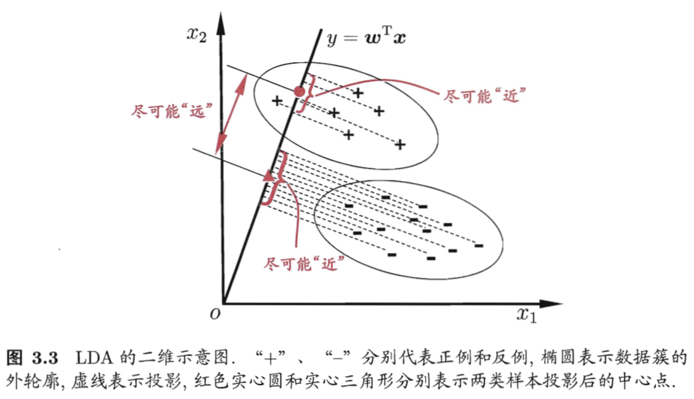
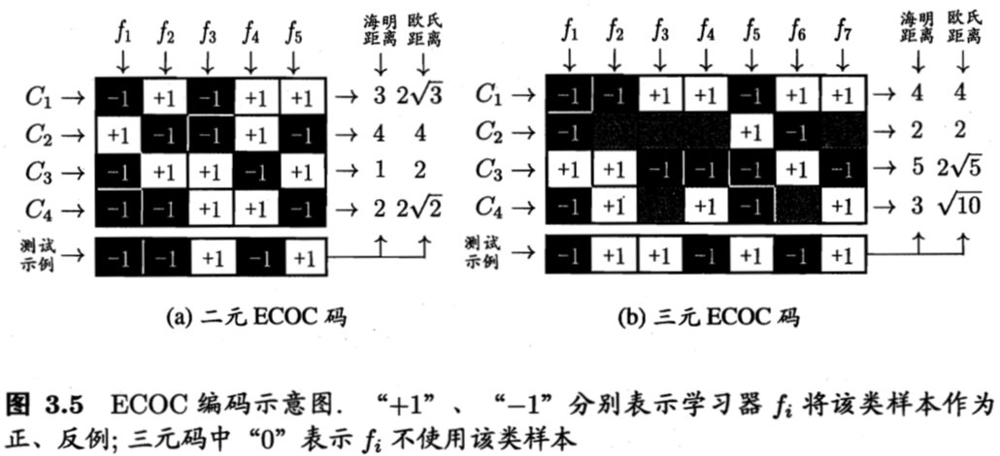

# 03 线性模型

## 3.1 基本形式

- 线性模型(linear model)试图学得一个通过属性的线性组合进行预测的函数 f(x)
- ω表达了各属性在预测中的重要性，有很好的解释性(comprehensibility)
  

## 3.2 线性回归 linear regression

- **最小二乘法(least square method)**: 基于均方误差最小化进行模型求解的方法，在线性回归中，试图找到一个直线，使所有样本到直线的欧式距离之和最小。
- 一元情况 x_i = (x_i1)
  

- 多元情况 x_i = (x_i1; x_i2; ... x_id)
    

    - 实际任务中，属性个数可能非常多甚至超过样例数，此时可解出多个 ω^ 它们都能使均方误差最小化，选择哪一个解作为输出由归纳偏好决定，常见做法是**引入正则化(regularization)项**
- 对数线性回归(log-linear regression)
  

## 3.3 对数几率回归 logistic regression

- 问题背景：将线性回归的预测值范围从 (-∞, +∞) 转换为 (0,1) 用于分类问题，理想函数为单位阶跃函数，但单位阶跃函数不连续不可微，需要找一个单调可微的替代函数
- 常用的替代函数为**对数几率函数(logistic function)**，对数几率函数是一种 **Sigmoid 函数**
  

- 将 z = wx + b 代入对数几率函数 f(z) 中，变形可得
  

- 其中 `y/(1-y)` 称为**几率(odds)**，反映了 x 作为正例的相对可能性，`ln(y/(1-y))` 称为**对数几率(logit)**
- 对数几率回归，虽然名字是"回归"，但实际是一种分类方法
    - 优点：
        - 直接对分类可能性进行建模，无需事先假设数据分布
        - 对率函数是任意阶可导函数，许多数值优化算法(梯度下降法/牛顿法)可直接用于求最优解
    - 求解 w 和 b: 极大似然法(maximum likelihood method)
      

## 3.4 线性判别分析 LDA

- LDA 是一种经典线性学习方法，思想非常朴素：对于二分类问题，设法将样例**投影到一条直线上**，使得同类样例的投影点尽量接近，不同类样例的投影点尽可能远离；对新样本分类时，将其投影到直线上，根据点的位置判断新样本类别。
  

- 多分类问题：N 分类 LDA 将样本投影到 N-1 维空间，N-1 通常远小于属性个数，因此 LDA 常被视为一种经典的**有监督降维技术**

## 3.5 多分类学习

- 基本策略：利用二分类学习器来解决多分类问题，将多分类任务拆分为若干个二分类任务求解

### 3.5.1 OvO = One vs. One

- 将 N 个类别两两配对，产生 N\*(N-1)/2 个二分类任务，每个分类器以 C_i 为正例，C_j为反例。测试阶段，新样本将同时提交给所有分类器，得到 N\*(N-1)/2 个分类结果，最终结果通过投票产生。

### 3.5.2 OvR = One vs. Rest

- 每次将一个类的样例作为正例、其他所有类的样例作为反例来训练 N 个分类器。测试阶段，若仅有一个分类器预测为正类，则为最终分类结果；若多个预测正类，则考虑置信度选择。
- OvR 与 OvO 相比，存储开销和测试时间更小，且训练时能用上所有训练样例，训练时间会更高；预测性能多数情形下两者差不多。

### 3.5.3 MvM = Many vs. Many

- 每次将若干个类作为正类，若干个类作为反类，构造正反类的方法为**纠错输出码(ECOC)**
  

- 测试阶段，ECOC 编码对分类器的错误有一定纠错能力，编码越长纠错能力越大
- 但确定最优编码本身是 NP-hard 问题

## 3.6 类别不平衡问题

- 前面介绍的分类学习方法有一个基本假设：不同类别的训练样本数目相当
- 类别不平衡(class-imbalance)时使用的方法
    - 对划定的阈值**再放缩(rescaling)**
        - 前提：训练集是真实样本集的无偏采样
        - 类别平衡时，阈值划定为0.5，表明正、反例可能性相同，几率 `y/(1-y) > 1` 则预测为正例
        - 若类别不平衡，设正/负例个数分别为 m+/m-，此时几率 `y/(1-y) > m+/m-` 则预测为正例
    - **欠采样(undersampling)**: 去除一些反例，但不能随机丢弃否则容易丢失重要信息；代表算法 EasyEnsemble 利用集成学习机制
    - **过采样(oversampling)**: 增加一些正例，但不能简单重复采样否则过拟合；代表算法 SMOTE 使用插值产生额外的正例
    - 阈值移动(threshold-moving)
