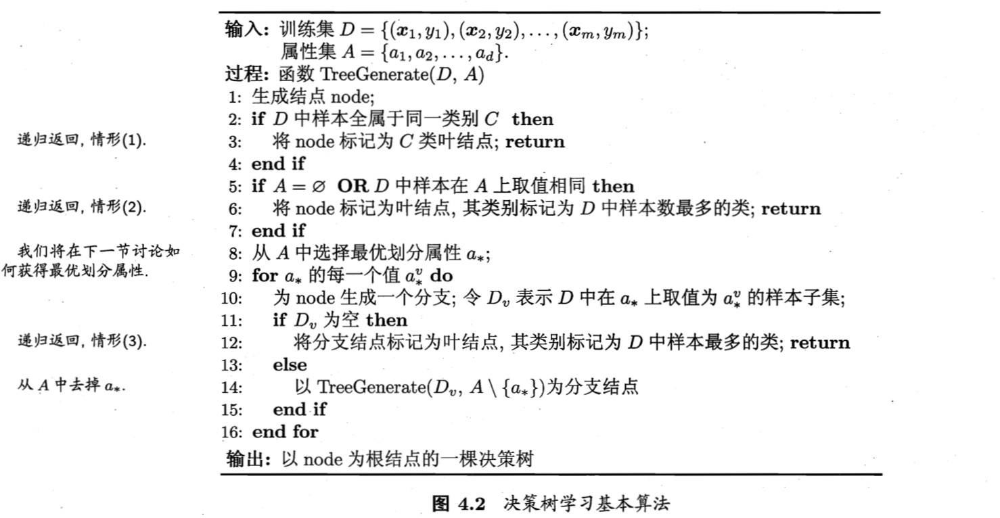
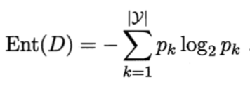
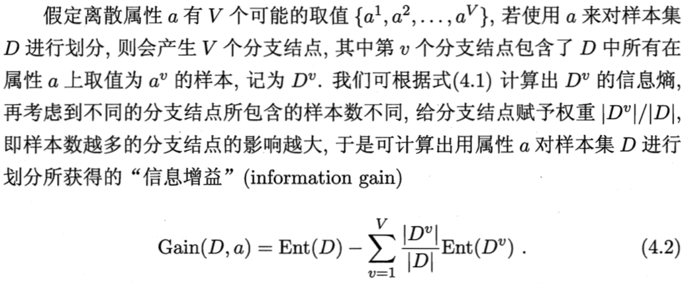
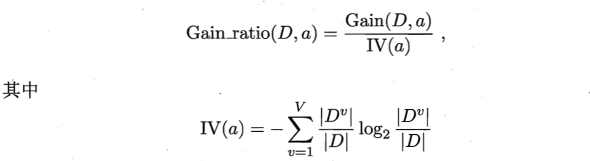
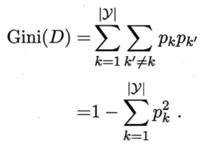
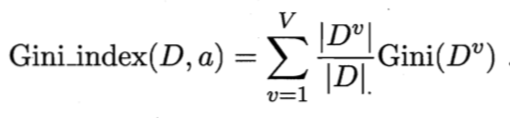

# 04 决策树

## 4.1 决策树基本算法

- 根节点：包含样本全集
- 非叶子节点：对某一个属性的测试，测试结果：对该节点上的样本集合进行划分，划分依据关于该属性的属性值
- 叶子节点：对应决策结果
- 基本流程：分治策略(divide-and-conquer)

## 4.2 划分选择

- 决策树学习的关键是**从属性集 A 中选择最优划分属性 a\***
- 随着划分不断进行，希望决策树的分支节点所包含的样本尽可能属于同一类别，即节点的 **purity(纯度)** 越来越高。

### 4.2.1 信息增益

- **ID3 决策树算法**就是以**信息增益**为准则来选择划分属性
- 信息熵(information entropy)
  

- 信息增益(information gain)
  

- 信息增益越大，意味着使用属性 a 来进行划分所获得的"纯度提升"越大

### 4.2.2 增益率

- **信息增益准则对可取值数目较多的属性有所偏好**
- **C4.5 决策树算法**使用增益率来选择最优划分属性：**先从候选划分属性中找出信息增益高于平均水平的属性，再从中选择增益率最高的**
- 增益率(gain ratio)
  

- IV = intrinsic value 固有值，属性 a 的可能取值数目越多，IV(a) 的值通常越大
- 增益率准则对可取值数目较少的属性有所偏好

### 4.2.3 基尼指数

- **CART 决策树算法**使用基尼指数选择划分属性：选择**划分后基尼指数最小**的属性作为最优划分属性
- 基尼指数(Gini index): **反映了从数据集 D 中随机抽取两个样本，其类别标记不一致的概率**
  

  

