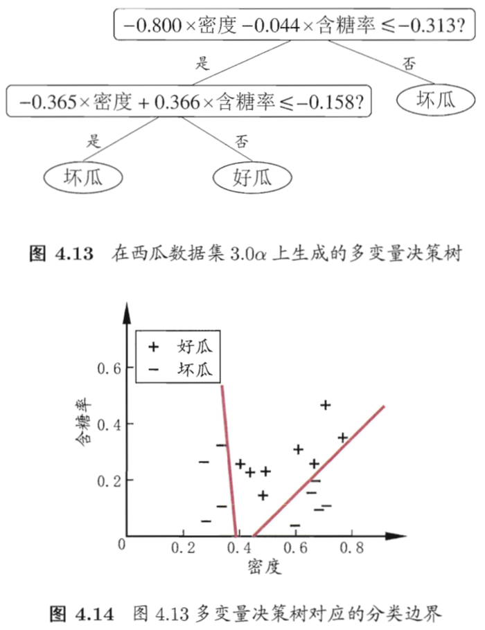

# 04 决策树

## 4.1 决策树基本算法

- 根节点：包含样本全集
- 非叶节点：对某一个属性的测试，测试结果：对该节点上的样本集合进行划分，划分依据关于该属性的属性值
- 叶子节点：对应决策结果
- 基本流程：分治策略(divide-and-conquer)

## 4.2 划分选择

- 决策树学习的关键是**从属性集 A 中选择最优划分属性 a\***
- 随着划分不断进行，希望决策树的分支节点所包含的样本尽可能属于同一类别，即节点的 **purity(纯度)** 越来越高。

### 4.2.1 信息增益 information gain

- **ID3 决策树算法**就是以**信息增益**为准则来选择划分属性
- 信息熵(information entropy)
  

- 信息增益
  

- 信息增益越大，意味着使用属性 a 来进行划分所获得的"纯度提升"越大

### 4.2.2 增益率 gain ratio

- **信息增益准则对可取值数目较多的属性有所偏好**
- **C4.5 决策树算法**使用增益率来选择最优划分属性：**先从候选划分属性中找出信息增益高于平均水平的属性，再从中选择增益率最高的**
- 增益率
  

- IV = intrinsic value 固有值，属性 a 的可能取值数目越多，IV(a) 的值通常越大
- 增益率准则对可取值数目较少的属性有所偏好

### 4.2.3 基尼指数 Gini index

- **CART 决策树算法**使用基尼指数选择划分属性：选择**划分后基尼指数最小**的属性作为最优划分属性
- 基尼指数: **反映了从数据集 D 中随机抽取两个样本，其类别标记不一致的概率**
- 理论分析显示，信息增益和基尼指数仅在2%的情况下会有所不同
  

  

## 4.3 剪枝 pruning

- 剪枝是决策树算法对付**过拟合**的主要手段
- 基本策略分为预剪枝和后剪枝
    - 预剪枝：在树的生成过程中，对每个节点划分前进行估计，若当前节点的划分不能带来泛化性能提升，则停止划分该节点
    - 后剪枝：生成完整的树以后，自底向上对非叶节点进行考察，若该节点对应子树替换为叶子能带来泛化提升，则替换为叶子
- 泛化性能的判断：在需要考察的节点上应用**验证集**评估，具体见《西瓜书》p81两个例子

## 4.4 连续与缺失值

### 4.4.1 属性值为连续值

- 连续属性离散化技术，二分法处理：对于连续属性 a 有 n 个不同取值，则有 n-1 种二分策略，从 n-1 种策略中求出信息增益最大的一种，作为属性 a 的信息增益
- **注意：与离散属性不同，划分属性是连续的当前节点，其后代节点仍可以使用该属性作为划分**
  

### 4.4.2 部分样例在某个属性有缺失值

- 两个问题
    - (1) 如何在属性值缺失的情况下计算信息增益
        - 计算增益时，数据集为有值的样本子集 D^~，且在增益公式上添加一些系数
    - (2) 给定划分属性，如何划分有缺失值的样本
        - 将样本同时划入所有子节点，但在不同子节点的权重不同
- 以上是 C4.5 算法采用的解决方案

## 4.5 多变量决策树 multivariate decision tree

- d 个属性构成一个 d 维空间，对样本分类意味着寻找不同类之间的**分类边界**，决策树形成的分类边界的特点：**轴平行(axis-parallel)**，即它的分类边界由若干与坐标轴平行的分段组成
  

- 若使用斜的分类边界，则决策树模型将大为简化
    - 多变量：每个节点为多个属性的线性组合
    

- 多变量决策树代表算法：OC1；直接引入线性分类器学习的最小二乘法；感知机树，在每个叶节点上训练一个感知机
