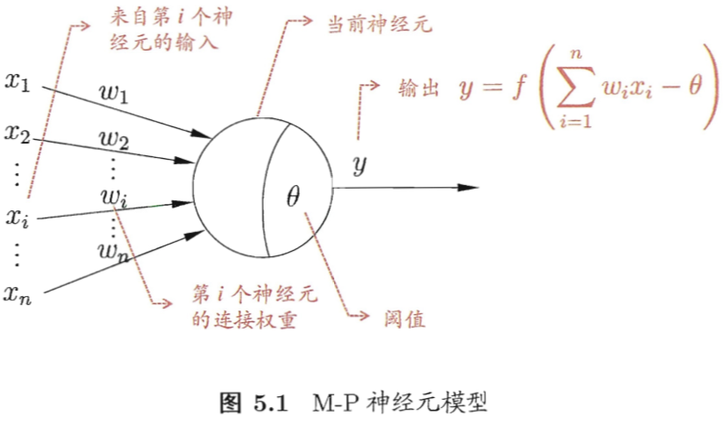
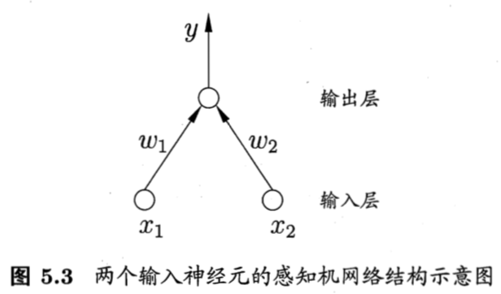
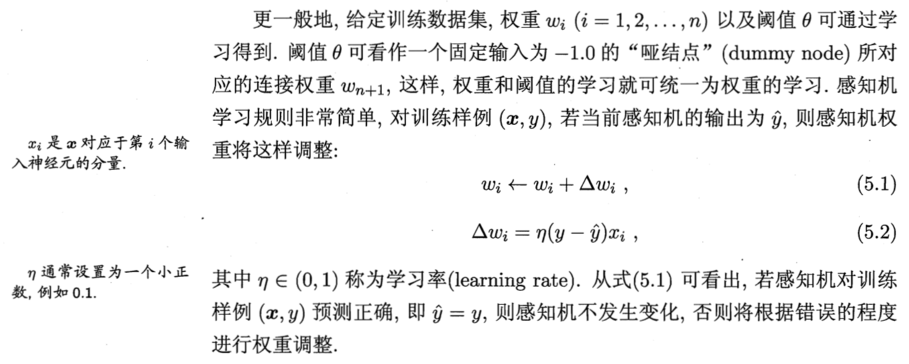
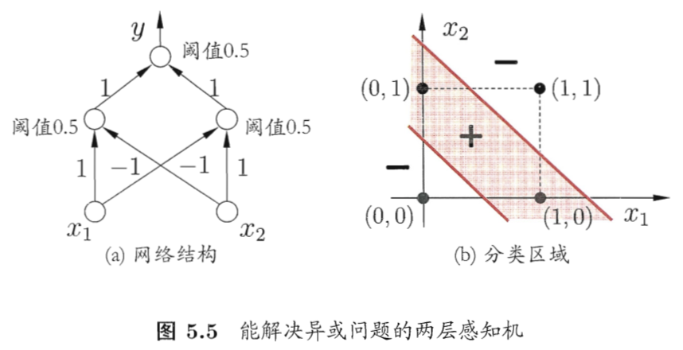
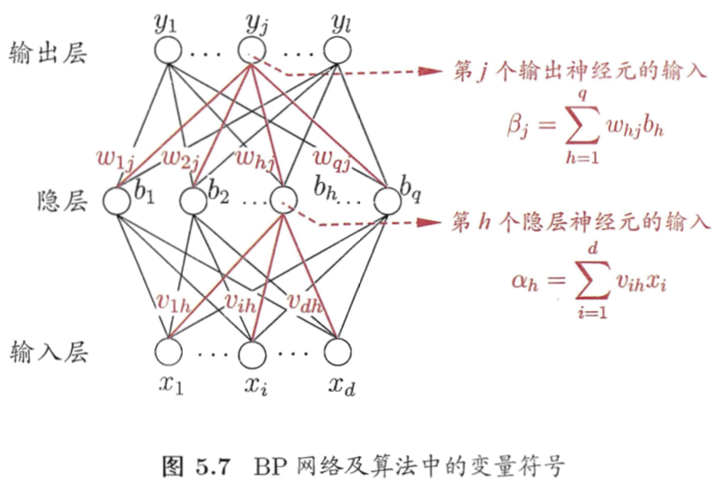
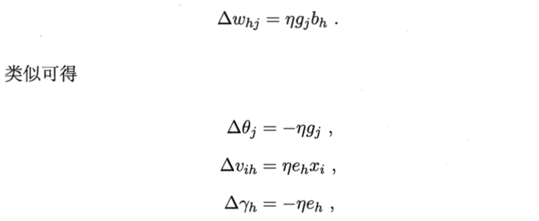
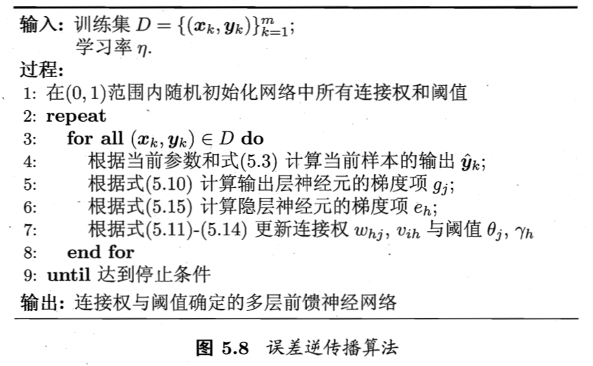
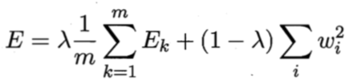
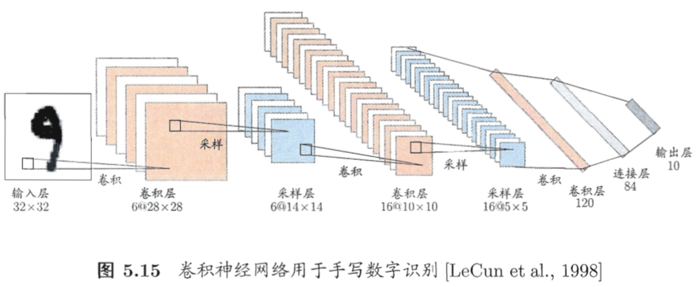

# 05 神经网络

## 5.1 神经元模型 neuron

- 神经元 neuron
    - 简单单元，"神经网络是由具有适应性的**简单单元**组成的广泛并行互连的网络"
- M-P 神经元模型
    - (1) 接收到来自 n 个其他神经元传递过来的输入信号，通过带权重的连接传递给神经元
    - (2) 神经元接收到总输入值与阈值进行比较
    - (3) 比较的结果通过激活函数(activation function)处理产生输出
      

- 理想的激活函数是单位阶跃函数，但数学性质不好，常用 Sigmoid 函数作为激活函数

## 5.2 感知机与多层网络

### 5.2.1 感知机 Perceptron

- 感知机由两层神经元组成，输入层接收外界输入信号传递给输出层，输出层为 M-P 神经元
- 设置合适的参数(ω1, ω2, θ)，感知机可以实现 and, or, not 运算，实质为分类问题
- 但是感知机不能实现 xor 运算，需要多层网络实现
  

- 感知机学习规则
  

- **可以证明：若两类模式是线性可分的，则感知机学习过程一定收敛求得具体的ω；否则学习过程会发生振荡，ω不能稳定下来**

### 5.2.2 多层网络

- 要解决非线性可分问题(如 xor 运算)，需要使用多层功能神经元
- 隐含层(hidden layer): 输出层和输入层中间的层，隐含层和输出层的神经元都是功能神经元
  

- 多层前馈神经网络 multi-layer feedforward neural network
    - 每层神经元与下一层神经元全互连
    - 神经元之间不存在同层连接，也不存在跨层连接
- 神经网络学习到的东西，蕴涵在神经元之间的**连接权(connection weight)**和阈值中。

## 5.3 误差逆传播算法 error BackPropagation = BP

- 多层前馈网路结构：d 个输入神经元，l 个输出神经元，q 个隐层神经元，则网络中有`(d+l+1)*q+l`个参数需要确定
  

- BP 算法基于梯度下降策略，每个参数 v 的更新估计式为 `v <- v + △v`，每个参数v的△v计算公式：
  

- 其中 g_j 和 e_h 分别为输出层神经元和隐藏层神经元的`梯度项`，与每次迭代的单个训练样本相关
- η 为学习率，控制每一轮迭代的更新步长，常设置为0.1
- BP 算法的停止条件：与缓解 BP 过拟合的策略有关
- BP 算法流程：
  

- 标准 BP 算法每次更新只针对单个样例，参数更新频繁；累积 BP 算法直接针对累积误差最小化，读取整个训练集一遍后才对参数更新。很多任务两者结合使用，累积 BP 算法使累积误差下降到一定程度后，进一步下降会非常缓慢，此时再用标准 BP 算法会更快获得较好的解。
- 理论证明，只需一个包含足够多神经元的隐层，多层前馈网路就能以任意精度逼近任意复杂度的连续函数，但如何设置隐层神经元个数是个未决问题，实际应用通常靠试错法(trial-by-error)调整
- 缓解 BP 网路过拟合的两种常用策略：
    - 早停(early-stopping): 训练集计算参数，验证集估计误差，若训练集误差下降但验证集误差上升，则停止训练
    - 正则化(regularization): 在误差目标函数增加一个用于描述网路复杂度的项
      

## 5.4 全局最小和局部极小

- 全局最小必然是局部极小，但反之未必是，基于梯度搜索只能找到局部极小，需要一些策略试图"跳出"局部极小，进一步接近全部最小
- 常用策略：多组不同参数值初始化；模拟退火(每一步有一定概率选择次优结果)；随机梯度下降(计算梯度时加入随机因素)；遗传算法
- 以上策略大多是启发式，缺乏理论上的保障

## 5.6 深度学习

- 理论上，参数越多，模型复杂度越高，可以完成更复杂的任务；但复杂模型训练效率低，易陷入过拟合。随着大数据时代到来，通过加大训练数据降低拟合风险。
- 深度学习(deep learning): 多个隐层的神经网络。从复杂度角度看，增加隐层层数比增加隐层神经元数更有效
- 多隐层 NN 难以直接用 BP 算法，主要有两种训练策略
    - 无监督逐层训练(unsupervised layer-wise training): "预训练+微调"，将大量参数分组，每组参数局部寻优，再联合每组结果进行全局寻优
        - 预训练(pre-training): 每次训练一层隐节点，将上层输出作为输入，本层输出作为下一层输入
        - 微调(fine-tuning)训练: 对整个网络使用 BP 算法
        - 例子：**深度信念网络(DBN)**
    - 权共享(weight-sharing): 让一组神经元使用相同的连接权
        - 例子：**卷积神经网络(CNN)**
- 卷积神经网络 Convolutional Neural Network
    - 输入数据通过多个复合的"卷积层"和"汇合层"(pooling)加工成高维特征向量，再通过"连接层"实现与输出目标的映射
    - 卷积层：包含多个特征映射(feature map)，每个特征映射是一个由多个神经元构成的"平面"，一个"平面"代表一个特征，通过卷积滤波器提取输入的一种特征
    - 汇合层：基于局部相关性原理进行亚采样，减少数据量，同时保留有用信息，一个卷积层平面对应一个汇合层平面
    - 连接权：无论是卷积层和汇合层，它们的同一个"平面"(即同一组神经元)都是用相同的连接权
      

