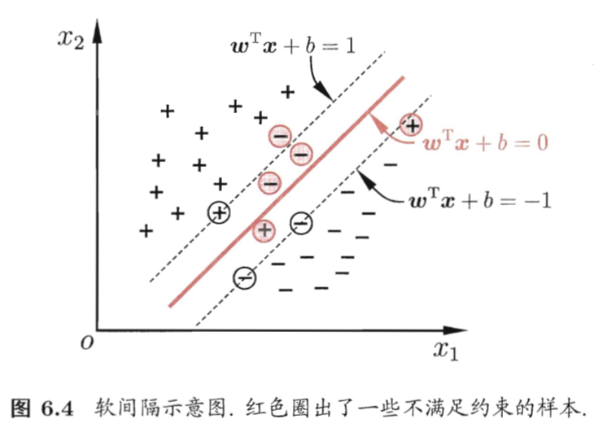

# 06 支持向量机

## 6.1 SVM 的基本型

- 在多个可能的划分超平面中，应选择"最中间"的那个，因为其对训练样本局部扰动的"容忍"性最好
  

  

## 6.2 对偶问题

- 利用拉格朗日乘子法可得到 SVM 基本型的对偶问题，即对每条约束添加拉格朗日乘子 α_i >= 0
- 对偶问题揭示了 SVM 的一个重要性质：**训练的最终模型仅与支持向量有关，大部分训练样本不需要保留**
  

  

## 6.3 核函数

- 对于不能线性可分的问题，可从样本从原始空间映射到更高维的特征空间，使样本在这个特征空间内线性可分
- φ(x) 表示 x 映射后的特征向量，SVM 基本型和对偶问题中的 x_i 换成 φ(x_i)
- 核函数: 高维向量的内积计算 `<φ(x_i), φ(x_j)>` 转化为关于低维向量的函数 `κ(x_i, x_j)`
  

- 通常不知道φ(x)的具体形式，"核函数选择"成为 SVM 的最大变数

## 6.4 软间隔与正则化

- SVM 的前提：假定存在一个超平面能在不同样本完全划分开
    - 局限1: 很难确定合适的核函数，使训练样本线性可分
    - 局限2: 即使找到这样一个核函数，也很难断定是否因为过拟合造成的
- 缓解局限性的方法：**软间隔(soft margin)** 允许 SVM 在一些样本上出错
  

  

- 但是**0/1损失函数**的数学性质不好(非凸非连续)，不易求解优化目标函数，需要找数学性质更好的**替代函数(surrogate loss)**来代替 l_0/1
- 常用的替代函数
    - **hinge损失** l_hinge(z) = max(0, 1-z)
    - 指数损失 l_exp(z) = exp(-z)
    - 对率损失 l_log(z) = log(1 + exp(-z))
      

- 用松弛变量(slack variable)表示对偶问题(略)
- **正则化(regularization)**
    - 以上的优化目标可以分为两部分：第一部分描述划分超平面的"间隔"大小(SVM 的某种性质)；第二部分描述训练集上的误差
    - 目标函数写成更一般的形式，分为两部分
        - **结构风险(structural risk)** 描述模型 f 的某些性质
            - 结构风险表述我们希望获得模型的性质(如较小复杂度的模型 -> 削减假设空间 -> 降低过拟合风险)
            - 从这个角度看，这种形式又称为**正则化问题**
                - Ω(f): 正则化项
                    - 常用正则化项：L_p 范数(norm)
                    - **L_2 范数倾向于 ω 的分量取值尽量均衡，即非零分量个数尽量稠**
                    - **L_0 L_1 范数倾向于 ω 分量尽量稀疏，即非零分量个数尽量少**
                - C: 正则化常数
        - **经验风险(empirical risk)** 描述模型与训练数据的契合度
    - 正则化可理解为一种"罚函数法"，惩罚不希望得到的结果，使优化过程趋于希望的目标。从贝叶斯估计角度看，正则化项可认为是提供了模型的先验概率。
      

## 6.5 支持向量回归 SVR = Support Vector Regression

- SVR 假设我们能容忍 f(x) 与 y 之间最多有 ε 的偏差，相当于以 f(x) 为中心，构建了一个宽度为 2ε 的间隔带，落入间隔带的样本点被认为预测正确
  

- 支持向量落在 ε-间隔带之外

## 6.6 核方法

- 给定训练样本，若不考虑偏移项 b，则无论 SVM 还是 SVR，学得的模型总能表示成核函数 κ(x, x_i) 的线性组合
- 更一般的结论：表示定理(representer theorem) (略)
- 核方法(kernel methods) 一系列基于核函数的学习方法，例如 KLDA (核线性判别分析)