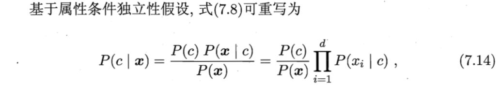
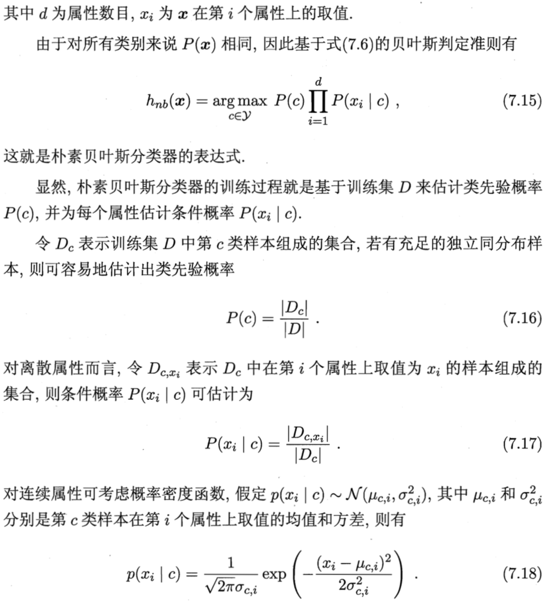
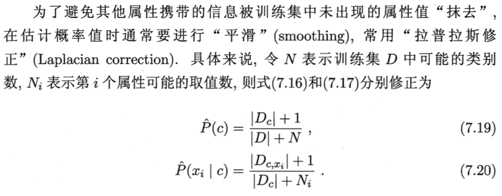
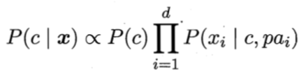

# 07 贝叶斯分类器

## 7.1 贝叶斯决策论 Bayesian decision theory

- 贝叶斯决策论：对分类任务，在所有相关概率都已知的理想情形下，如何基于这些概率和误判损失来选择最优的类别标记
- 期望损失(expected loss)：样本 x 被标记为类别 c_i 标记错误的损失的期望值，记为 **R(c_i|x)**，也称为样本 x 上的**条件风险(conditional risk)**
    - 决策论中将"期望损失"称为风险(risk)
  

- 贝叶斯判定准则(Bayes decision rule)：为最小化总体风险，只需在**每个样本**上选择哪个能使条件风险 R(c\|x) 最小的类别标记，此时 h = h\* 称为**贝叶斯最优分类器**，对应的总体风险 R(h\*) 称为**贝叶斯风险**，`1 - R(h*)` 反映了模型精度的理论上限
- 损失函数 λ_ij 为0/1损失函数(目标为最小化分类错误率)，此时可以推导出**贝叶斯最优分类器 h\* 为"对每个样本 x 选择能使后验概率 P(c\|x) 最大的类别标记"**
  

- 因此，若使用贝叶斯判定准则最小化决策风险，首先要获得后验概率 P(c\|x)，从概率框架的角度理解机器学习，需要通过训练样本估计出 P(c\|x)，两种策略：
    - 判别式模型(discriminative models)：直接建模 P(c\|x)，决策树、BP 神经网络、SVM 都属于判别式模型
    - 生成式模型(generative models)：建模联合概率分布 P(c,x)，然后 P(c\|x) = P(c,x) / P(c)

- **贝叶斯定理** P(c\|x) = P(c) * P(x\|c) / P(x)
> 后验概率 P(c|x): 已知样本 x，求 x 是分类 c 的概率大小 
> 先验概率 P(c): 一个未知的样本是分类 c 的概率大小 
> 条件概率 P(x|c): 在类 c 的所有可能的样本中，出现样本 x 的概率大小，又称为**似然(likelihood)** 
> 证据因子 P(x): 用于归一化，与类标记无关(对所有类标记相同) 
-
    - 因此，估计 P(c\|x) 的问题转化为估计先验 P(c) 和似然 P(x\|c)
    - 估计 P(c): 用 c 出现的频率估计(独立同分布假设，大数定律)
    - 估计 P(x\|c): 样本空间大小随特征维数指数增长，不能用频率估计，"未被观测到"与"出现概率为0"是不一样的
        - 解决：极大似然估计

## 7.2 极大似然估计

- 假设具有某种确定的概率分布形式: 估计条件概率 \-> 估计概率分布的参数 参数估计(parameter estimation)
- 关于参数估计的两个学派
    - **频率主义学派(Frequentist)** 参数是未知的固定值
        - 参数估计方法：通过优化似然函数等准则确定参数值
    - **贝叶斯学派(Bayesian)** 参数是未观察到的随机变量，本身可有分布
        - 参数估计方法：假定参数服从一个**先验分布**，然后基于观测到的数据计算参数的后验分布
- 极大似然估计(MLE)
    - 频率主义学派，根据数据采样估计概率分布参数的经典方法
    - MLE 试图在 θ_c 所有可能的取值中，找到一个能使数据出现的"可能性"最大的值
    - **估计结果的准确性**严重依赖于所假设的概率分布形式，是否符合潜在的真实数据分布

## 7.3 朴素贝叶斯分类器

- **属性条件独立性假设**：对已知类别，假设所有属性相互独立 (实质避开了属性上的联合概率)
  

  

- **拉普拉斯修正(Laplacian correction)** 对估计概率值进行平滑处理(smoothing)
    - 背景：若某个属性的属性值没在训练样本出现，则测试样本出现该属性值时估计概率值 = 0
    - 先验假设：属性值与类别均匀分布
      

## 7.4 半朴素贝叶斯分类器

- 属性条件独立性假设在现实中很难成立，改进：半朴素贝叶斯分类器(semi-naive Bayes classifiers)
- "半朴素"基本想法：适当考虑一部分属性间的相互依赖信息，从而既不需进行完全联合概率计算，又不至于彻底忽略比较强的属性依赖关系
- 常用策略：独依赖估计(One-Dependent Estimator, ODE) 假设每个属性除了类别 c 之外，最多仅依赖于一个其他属性
  

- pa_i 称为属性 x_i 的父属性，若每个属性的父属性确定，则可用类似上述的方法求解 P(x_i|c,pa_i)，问题转化为如何确定每个属性的 pa_i
    - SPODE(Super-Parent ODE) 假设所有属性都依赖同一个属性("超父")
    - TAN(Tree Augmented naive Bayes) 以"条件互信息"为边权的属性节点完全图，求最大权生成树，得到每个节点的父节点
    - AODE(Averaged ODE) 基于集成学习机制，尝试每个属性作为超父构建 SPODE，挑选合适的 SPODE 集成起来作为最终结果
- 进一步提升泛化性能：贝叶斯网络

## 7.5 贝叶斯网络
