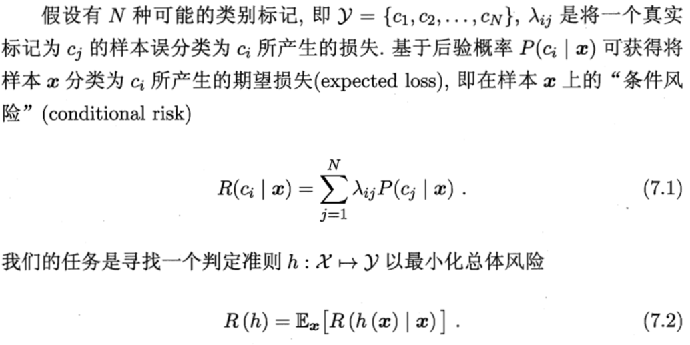
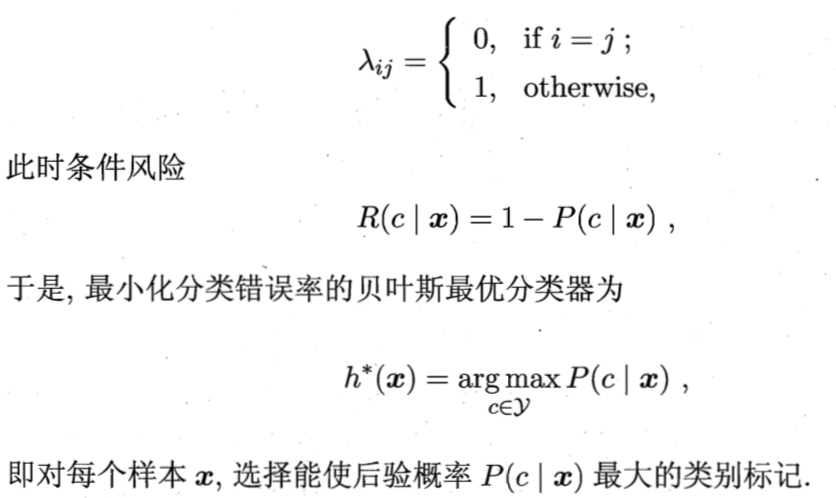

# 07 贝叶斯分类器

## 7.1 贝叶斯决策论 Bayesian decision theory

- 贝叶斯决策论：对分类任务，在所有相关概率都已知的理想情形下，如何基于这些概率和误判损失来选择最优的类别标记
- 期望损失(expected loss)：样本 x 被标记为类别 c_i 标记错误的损失的期望值，记为 **R(c_i|x)**，也称为样本 x 上的**条件风险(conditional risk)**
    - 决策论中将"期望损失"称为风险(risk)
  

- 贝叶斯判定准则(Bayes decision rule)：为最小化总体风险，只需在**每个样本**上选择哪个能使条件风险 R(c\|x) 最小的类别标记，此时 h = h\* 称为**贝叶斯最优分类器**，对应的总体风险 R(h\*) 称为**贝叶斯风险**，`1 - R(h*)` 反映了模型精度的理论上限
- 损失函数 λ_ij 为0/1损失函数(目标为最小化分类错误率)，此时可以推导出**贝叶斯最优分类器 h\* 为"对每个样本 x 选择能使后验概率 P(c\|x) 最大的类别标记"**
  

- 因此，若使用贝叶斯判定准则最小化决策风险，首先要获得后验概率 P(c\|x)，从概率框架的角度理解机器学习，需要通过训练样本估计出 P(c\|x)，两种策略：
    - 判别式模型(discriminative models)：直接建模 P(c\|x)，决策树、BP 神经网络、SVM 都属于判别式模型
    - 生成式模型(generative models)：建模联合概率分布 P(c,x)，然后 P(c\|x) = P(c,x) / P(c)

- **贝叶斯定理** P(c\|x) = P(c) * P(x\|c) / P(x)
    > 后验概率 P(c|x): 已知样本 x，求 x 是分类 c 的概率大小 
    > 先验概率 P(c): 一个未知的样本是分类 c 的概率大小 
    > 条件概率 P(x|c): 在类 c 的所有可能的样本中，出现样本 x 的概率大小，又称为**似然(likelihood)** 
    > 证据因子 P(x): 用于归一化，与类标记无关(对所有类标记相同) 
-
    - 因此，估计 P(c\|x) 的问题转化为估计先验 P(c) 和似然 P(x\|c)
    - 估计 P(c): 用 c 出现的频率估计(独立同分布假设，大数定律)
    - 估计 P(x\|c): 样本空间大小随特征维数指数增长，不能用频率估计，"未被观测到"与"出现概率为0"是不一样的，解决：极大似然估计

## 7.2 极大似然估计